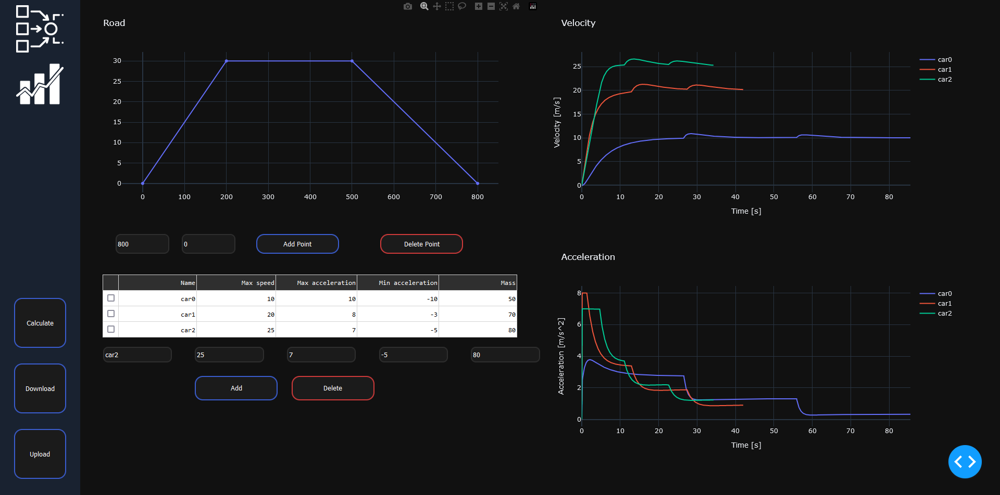

System podtrzymywania prędkości w pojeździe.

Aplikacja webowa z wykorzystaniem frameworka Dash.

Program symuluje zachowanie pojazdów z określonymi parametrami na zadanej trasie. Obserwowane są zmiany prędkości oraz przyśpieszenia pojazdów w czasie a wyniki przedstawione są w postaci wykresów.

